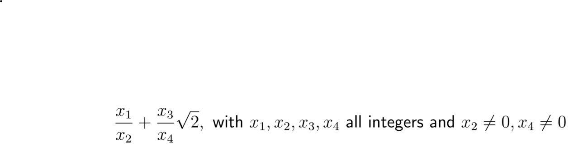
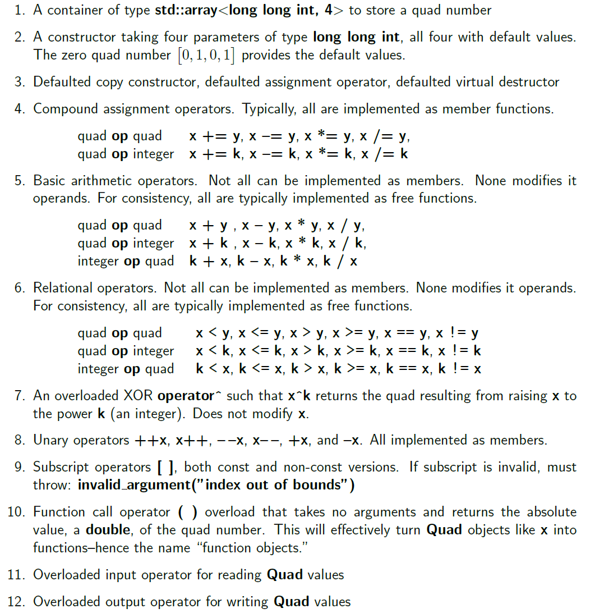
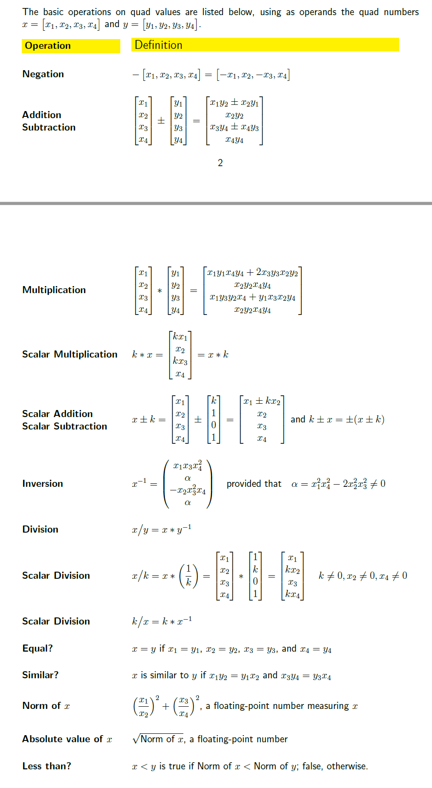

# Quad-ADT-Implementation

An Abstract Data Type representing a set of values of the form:

The ADT is implemented in a way such that various operation can be performed on 1 or more Quad objects.

# Implementation

# Operations

